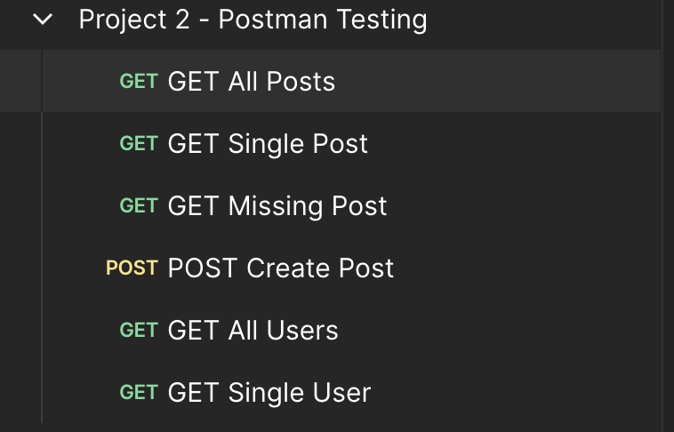
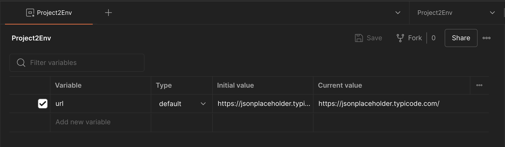
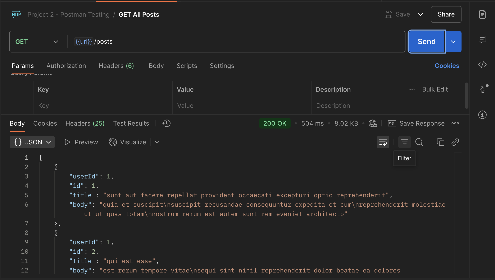
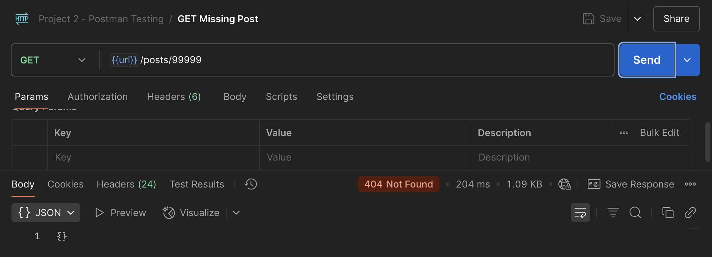
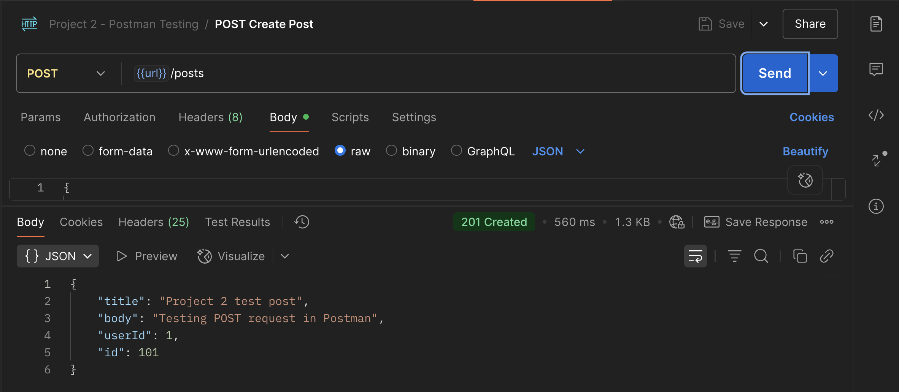

# Project 2: Integration Testing with Postman

## Introduction

This project focused on integration testing using Postman and public API endpoints. Integration testing verifies that systems communicate correctly through APIs and other interfaces. In this assignment, Postman was used to send requests, inspect responses, validate status codes, and review returned JSON data.

The project also demonstrated the importance of HTTP methods, reusable environments, collections, and error handling when testing APIs.

---

# Part 1: Research

## What is HTTP?

HTTP (HyperText Transfer Protocol) is the communication standard used between clients and servers on the internet.

- **Client:** The system sending the request (browser, Postman, mobile app)
- **Server:** The system receiving the request and returning data
- **Request:** A message sent by the client asking for data or requesting an action
- **Response:** A message returned by the server containing data and status information
- **Headers:** Metadata such as content type, authorization, and cache rules
- **Body:** The actual payload or returned data

## Common HTTP Status Codes

- **200 OK** – Request successful  
- **201 Created** – Resource created successfully  
- **404 Not Found** – Resource does not exist  
- **500 Internal Server Error** – Server-side problem  

## Common HTTP Verbs

- **GET** – Retrieve data  
- **POST** – Create new data  
- **PUT** – Update existing data  
- **DELETE** – Remove data  

## Why HTTP is Stateless

HTTP is stateless because each request is independent. The server does not automatically remember previous requests unless sessions, cookies, or tokens are used.

---

## Role of APIs in Modern Applications

APIs allow different software systems to communicate with each other. Modern applications use APIs for payments, authentication, maps, databases, cloud systems, and mobile apps.

## What are Open APIs?

Open APIs are publicly available APIs that developers can access for integration and development.

### Example Uses

- Google Maps API for navigation  
- Stripe API for payments  
- Weather APIs for forecasts  
- GitHub API for repositories  

---

## What is CORS?

CORS (Cross-Origin Resource Sharing) is a browser security mechanism that controls whether a website can request data from another domain.

It helps prevent unauthorized cross-site requests unless permission is granted by the server.

---

## How APIs are Secured

APIs are commonly secured using:

- API keys  
- OAuth tokens  
- JWT authentication  
- HTTPS encryption  
- Rate limiting  

---

## Five Public Open APIs

1. JSONPlaceholder  
2. CoinGecko API  
3. OpenWeather API  
4. REST Countries API  
5. NASA Open API  

---

# Part 2: Postman Testing Demonstration

## Collection Created

A Postman collection named:

`Project 2 - Postman Testing`

was created to organize all requests.



---

## Environment Created

A Postman environment named:

`Project2Env`

was created with the variable:

- `url = https://jsonplaceholder.typicode.com`

This allowed reusable request URLs.



---

# Requests Performed

## Request 1 – GET All Posts

```
GET {{url}}/posts
```



## Request 2 – GET Single Post

```GET {{url}}/posts/1```

### Request 3 – GET Missing Post

```GET {{url}}/posts/99999```




### Request 4 – POST Create Post

```POST {{url}}/posts

{
  "title": "Project 2 test post",
  "body": "Testing POST request in Postman",
  "userId": 1
}
```



### Request 5 – GET All Users

```GET {{url}}/users```

### Request 6 – GET Single User

```GET {{url}}/users/1```

### CRUD / Persistence Discussion

The JSONPlaceholder API simulates CRUD operations. It accepts POST requests and returns successful responses, but it does not permanently store submitted data in a production database. It is designed for testing and learning.

Error Handling Example

The request:

```GET {{url}}/posts/99999```
returned a missing resource response, demonstrating how APIs handle invalid requests.

### Conclusion

This project improved my understanding of integration testing, APIs, HTTP requests, status codes, and Postman collections. I learned how to organize multiple requests, reuse environment variables, validate responses, and test successful and failed scenarios.

Postman is a practical tool for API testing because it allows users to validate integrations without writing custom application code.