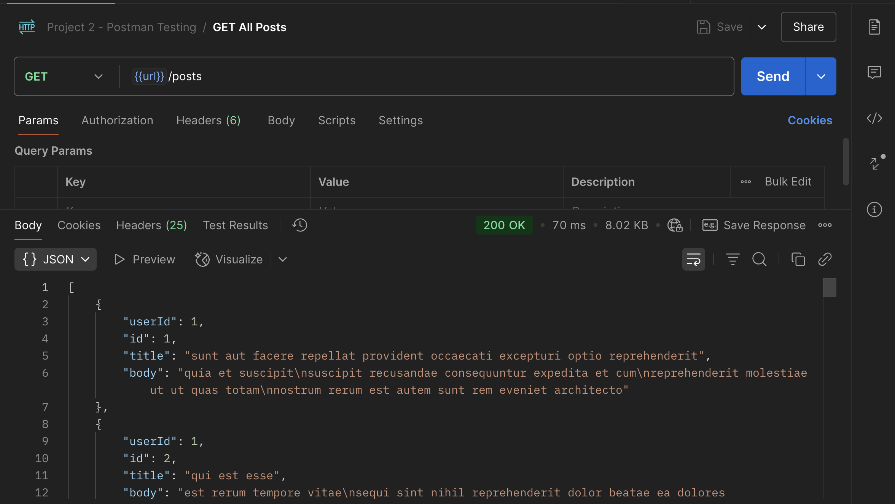
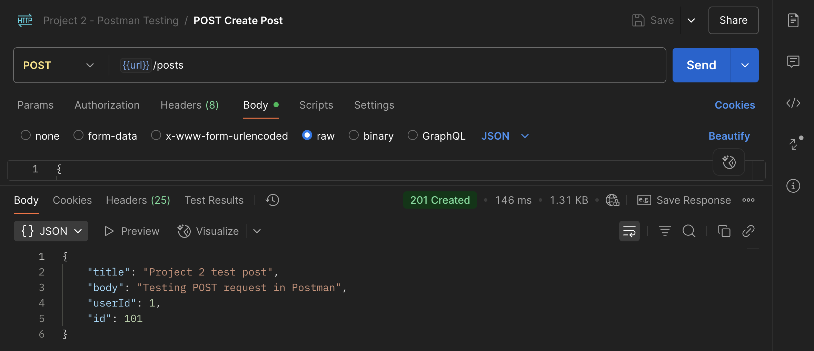

# Final Presentation – Software Quality and Testing

## 1. Target Testing Applications

The main applications and tools I used were:

| Assignment | Target Application | Testing Tool |
|---|---|---|
| Project 1 | Triangle classification program | Unit tests |
| Project 2 | JSONPlaceholder API | Postman |
| Project 3 | HTTPBin / web endpoint | JMeter |
| Project 4 | SauceDemo e-commerce site | Katalon Recorder / Selenium-based testing |
| Vibe Coding | Ruby CLI apps | GitHub Copilot + manual testing |

For the vibe coding assignments, I used Ruby command-line applications to demonstrate testing concepts. GitHub Copilot helped generate starter code, but I still reviewed and tested the output manually.

### Example Application (Vibe Coding – Decision Tables)

This is a Ruby CLI application I built using GitHub Copilot to demonstrate decision tables and pairwise testing.

---

## 2. Summary of Results from Four Assignments

### Project 1 – Unit Testing

For Project 1, I created a triangle classification program. The program checked whether three side lengths formed a valid triangle and identified the triangle type, such as scalene, isosceles, or equilateral.

The unit tests helped verify sunny-day cases and rainy-day cases such as invalid side lengths.

**Result:** Unit testing helped confirm the program logic worked across valid and invalid inputs.

---

### Project 2 – Postman Integration Testing

For Project 2, I used Postman to test public API endpoints from JSONPlaceholder.

I created:
- a Postman collection
- an environment variable for the base URL
- multiple GET requests
- a POST request
- an error-handling request

Example API testing:

**Result:** Postman helped validate API responses, status codes, returned JSON data, and failed request behavior.

---

### Project 3 – JMeter Performance Testing

For Project 3, I used Apache JMeter to run performance tests against a web endpoint.

The tests included:
- endurance testing
- load testing
- spike testing

I reviewed response times, throughput, and error rates.

**Result:** JMeter showed how performance changes as user traffic increases.

---

### Project 4 – Selenium User Testing

For Project 4, I used Katalon Recorder, which is Selenium-based, to test SauceDemo.

The tests focused on:
- logging in
- adding an item to the cart
- verifying the cart item and price

**Result:** Selenium-style testing helped demonstrate browser automation, but also showed that UI tests can be unstable because of timing, browser focus, and element detection issues.

---

## 3. Short Demo of One Test

For my demo, I will show the Project 2 Postman test.

Demo steps:

1. Open the Postman collection  
2. Run `GET {{url}}/posts`  
3. Show the returned JSON response  
4. Run `POST {{url}}/posts`  
5. Show the `201 Created` response  

---

## 4. Analysis of Agentic AI Coding Tools

I used AI tools such as ChatGPT and GitHub Copilot during the course.

### Pros

Agentic AI tools were useful because they helped:

- generate starter code quickly  
- explain testing concepts  
- create sample applications  
- troubleshoot errors  
- organize markdown write-ups  
- suggest test cases  

A real example was the Week 5 movie ticket app. GitHub Copilot helped create the Ruby program, and then I tested sunny-day and rainy-day inputs myself.

### Cons

AI tools also have limitations:

- they can overbuild simple assignments  
- they may generate code that works but is harder to explain  
- they can miss edge cases  
- they may assume requirements that were not given  
- they do not replace human validation  

A real example was the Selenium project. The tool sometimes reported a test as passed even when the browser did not visually confirm the expected behavior. That showed me that passing automation steps is not the same as proving the application worked correctly.

### Special Considerations for Testing

Testing with AI requires careful review. The tester still needs to verify:

- expected results  
- actual results  
- edge cases  
- error handling  
- assertions  
- screenshots or evidence  
- whether the code truly meets the requirement  

AI can help create tests, but it should not be trusted without manual review.

---

## Conclusion

This course helped me practice several types of software testing, including unit testing, integration testing, performance testing, user interface testing, and test case analysis.

The biggest lesson I learned is that testing is not only about running code. It is about proving that software behaves correctly under expected and unexpected conditions.

AI tools helped speed up development, but human judgment was still necessary to confirm results and understand whether the tests were meaningful.