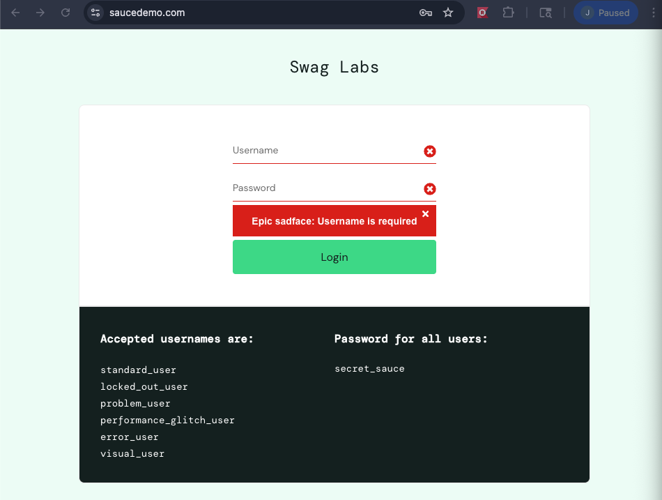
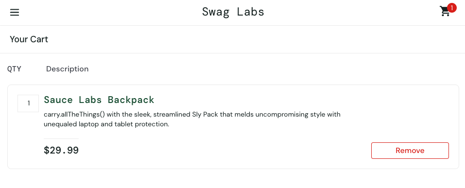

# Project 4: User Testing with Selenium (Katalon Recorder)

## Introduction
In this project, I performed user testing on the SauceDemo web application using browser automation tools. I used Katalon Recorder (a Selenium-based tool) in Chrome to automate test cases such as logging in and interacting with items in the store. Due to tool instability and inconsistent automation behavior, I supplemented the automated tests with manual validation to ensure accurate results.

---

## Environment Setup
- OS: macOS
- Browser: Google Chrome
- Tool: Katalon Recorder (Chrome Extension)
- Website Tested: https://www.saucedemo.com/

---

## Test Case 1: Login Test

### User Story
As a user, I want to log in so that I can access the product inventory.

### Steps Performed
1. Open https://www.saucedemo.com/
2. Click on the username field
3. Enter username: `standard_user`
4. Click on the password field
5. Enter password: `secret_sauce`
6. Click the login button

### Expected Result
The user is successfully logged in and redirected to the Products page.

### Actual Result
The test executed successfully according to Katalon. However, due to inconsistent automation behavior, login success was not always visually confirmed during replay.

---

## Test Case 2: Add Item to Cart

### User Story
As a user, I want to add an item to my cart so I can prepare for checkout.

### Steps Performed (Manual Validation)
1. Open SauceDemo website
2. Log in with valid credentials
3. Click "Add to cart" for **Sauce Labs Backpack**
4. Click the shopping cart icon

### Expected Result
The selected item appears in the shopping cart.

### Actual Result
The item was successfully added to the cart when performed manually.

## Test Case 3: Verify Cart Item and Price

### User Story
As a user, I want to verify the correct item and price in my cart.

### Steps Performed (Manual Validation)
1. Log in to SauceDemo
2. Add "Sauce Labs Backpack" to cart
3. Open cart
4. Verify item name
5. Verify price

### Expected Result
- Item name: Sauce Labs Backpack
- Price: $29.99

### Actual Result
The cart displayed the correct item and price.

---

## Issues Encountered

- Selenium IDE (Firefox) had compatibility issues
- Katalon Recorder in Chrome executed steps but did not always properly interact with input fields
- Automated tests sometimes passed without validating actual UI changes
- Input fields occasionally did not receive text due to browser focus issues
- Element detection failed intermittently even with correct selectors

---

## Key Learning

- Executing test steps is not the same as validating application behavior
- Assertions (e.g., verifying page content) are necessary for meaningful tests
- Automation tools depend heavily on browser compatibility and timing
- Manual testing is still valuable when automation becomes unreliable
- Proper synchronization (waits) is critical in UI automation

---

## Conclusion

This project demonstrated both the potential and limitations of browser automation tools. While I was able to automate basic test steps, tool instability prevented consistent validation of outcomes. Through this process, I learned the importance of assertions, timing, and combining manual testing with automation to ensure accurate results. Reliable testing requires not only executing steps but also verifying that the application behaves as expected.
