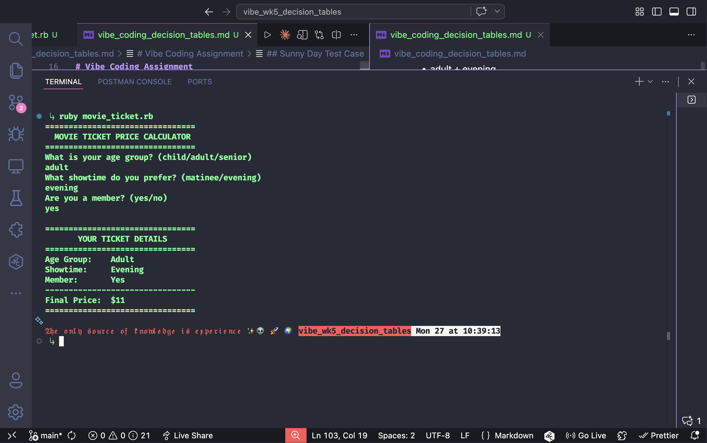

# Vibe Coding Mini Project – Week 5  
# Decision Tables / Pairwise Testing

## Introduction

This assignment focused on two black-box testing techniques: **Decision Tables** and **Pairwise Testing**.

Decision table testing is used when a system has multiple input conditions that combine to create different outputs. It helps organize business rules into a table so all combinations can be tested logically.

Pairwise testing reduces the number of tests needed by ensuring every pair of inputs is tested at least once. This is useful when full combination testing would require too many test cases.

To demonstrate these concepts, I used GitHub Copilot to help create a Ruby command-line application named `movie_ticket.rb`. The app calculates movie ticket prices based on customer selections.

---

# Vibe Coding Assignment

## Application Overview

The Ruby app asks the user for three inputs:

1. Age Group:
   - child
   - adult
   - senior

2. Showtime:
   - matinee
   - evening

3. Membership:
   - yes
   - no

The program then calculates the final ticket price using pricing rules.

---

## Pricing Rules

| Condition | Price Impact |
|--------|-------------|
| child | $8 |
| adult | $12 |
| senior | $10 |
| matinee | -$2 |
| member | -$1 |

---

## Why This Demonstrates Decision Tables

The application contains:

- 3 age groups
- 2 showtimes
- 2 membership options

This creates:

3 × 2 × 2 = **12 possible combinations**

Each combination can produce a different result.

Example:

| Age Group | Showtime | Member | Final Price |
|----------|----------|--------|------------|
| adult | evening | no | $12 |
| adult | matinee | yes | $9 |
| senior | matinee | yes | $7 |

---

## Why This Demonstrates Pairwise Testing

Instead of manually testing all 12 combinations, pairwise testing allows fewer tests while still ensuring each pair of inputs is covered.

Examples:

- adult + evening
- adult + matinee
- child + yes
- senior + no
- matinee + yes
- evening + no

This improves efficiency while maintaining strong coverage.

---

## Sunny Day Test Case

Input:

```text
adult
evening
yes
```

Expected Output:

`Final Price: $11`



## Rainy Day Test Case

The app also validates incorrect input.

Example invalid entries:

```
3
idk
y
```


```
if showtime == 'matinee'
  price -= 2
end

if is_member == 'yes'
  price -= 1
end
```
## Problems Encountered

- Needed to ensure invalid inputs looped correctly
- Had to verify pricing combinations manually
- Needed to keep code simple and readable
- Learned how to test interactive terminal programs

## What I Learned About AI Tools

GitHub Copilot was helpful for:

* Generating clean starter code
* Organizing functions
* Suggesting validation logic
* Speeding up development

However, human review was still required to verify logic and testing accuracy.

## Conclusion

This assignment helped me understand how decision tables are useful when multiple conditions affect one output. It also showed how pairwise testing can reduce the number of test cases while still providing strong coverage.

Using AI tools made development faster, but testing and validation were still necessary. This project improved both my software testing knowledge and my ability to work with coding assistants.