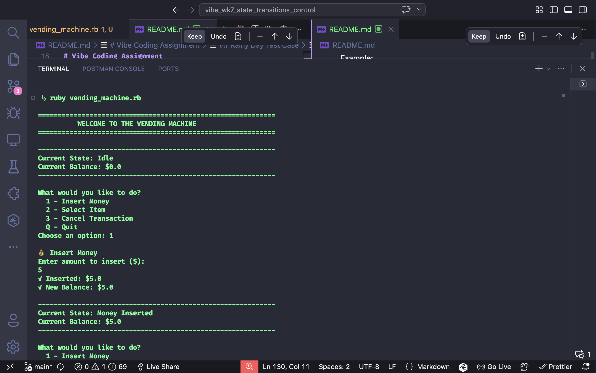
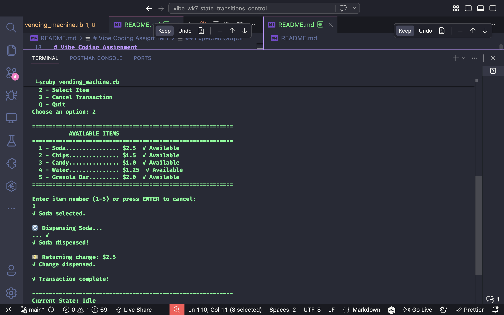
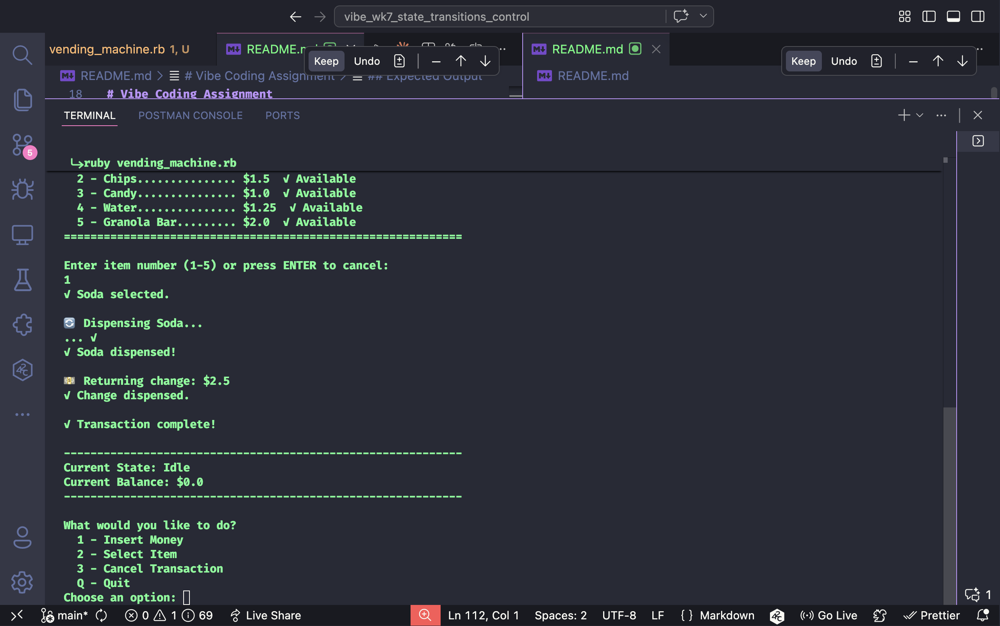
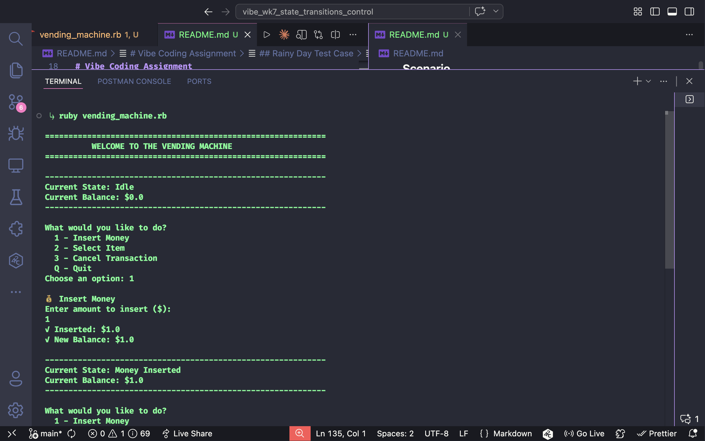
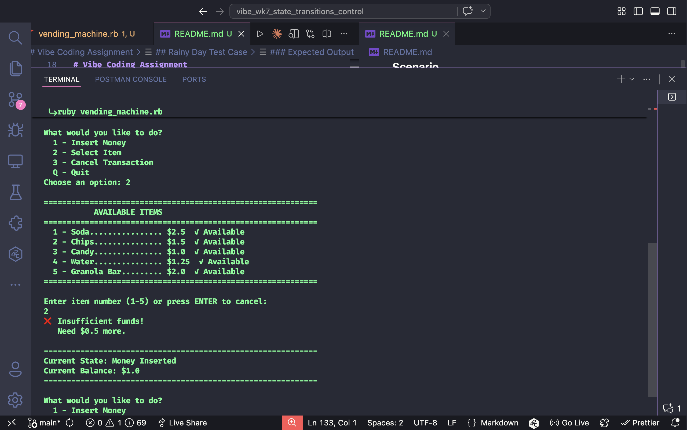
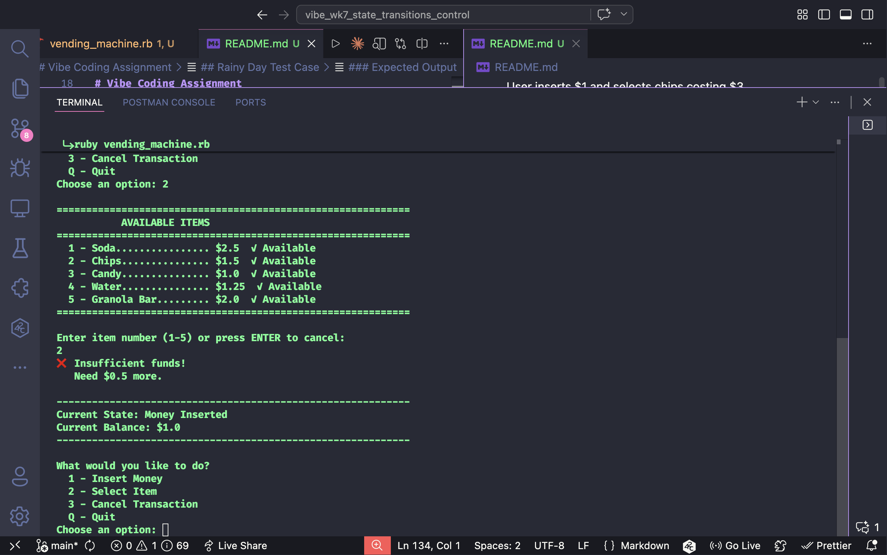

# Vibe Coding Mini Project – Week 7  
# State Transitions / Control Flow Testing / Data Flow Testing

## Introduction

This assignment focuses on three software testing techniques: **State Transition Testing**, **Control Flow Testing**, and **Data Flow Testing**.

**State Transition Testing** is used when software changes behavior based on its current state. This is common in systems such as vending machines, ATMs, login systems, traffic lights, and shopping carts.

**Control Flow Testing** focuses on the logic paths inside a program. It verifies that conditions, decisions, loops, and branches execute correctly.

**Data Flow Testing** focuses on how data is created, modified, used, and validated throughout a program.

To demonstrate these concepts, I created a simple Ruby command-line application named `vending_machine.rb`.

---

## Application Overview

The Ruby app simulates a vending machine.

Users can:

1. Insert money  
2. Select an item (Soda or Chips)
3. Receive an item if enough money is available  
4. Receive change  
5. Handle invalid selections  
6. Handle insufficient funds  

The application is 121 lines of beginner-friendly Ruby code with clear comments marking state transitions, control flow, and data flow.

---

## Why This Demonstrates State Transitions

The vending machine changes between states depending on user actions.

### States Used

| Current State | Action | Next State | Explanation |
|---|---|---|---|
| Idle | Insert Money | Money Inserted | User enters amount |
| Money Inserted | Select Valid Item + Sufficient Funds | Dispensing | Item checks pass |
| Dispensing | Item Dispensed | Complete | Item dispensed successfully |
| Money Inserted | Select Invalid Item | Error | Invalid choice or insufficient funds |
| Error | Error Detected | Back to Error State | Shows error message |

This shows how systems move from one state to another based on inputs and conditions.

---

## Why This Demonstrates Control Flow Testing

The app uses decision logic such as:

```ruby
if balance >= item_price
  state = "Dispensing"
  # dispense item
else
  state = "Error"
  # show insufficient funds
end
```

### Different inputs trigger different execution paths:

- **Sufficient funds path**: Insert $5 → Select $2 item → Dispense → Return change
- **Insufficient funds path**: Insert $1 → Select $3 item → Show error
- **Invalid item path**: Select item 3 → Show error "Invalid selection"

---

## Why This Demonstrates Data Flow Testing

The program manages data values such as:

- `money_input` (user input string)
- `balance` (converted to float)
- `item_choice` (user input string)
- `item_name` (set by case statement)
- `item_price` (set by case statement)
- `change` (calculated value: balance - price)

Example data flow:

```
money_input = "5"
  ↓ (convert with to_f)
balance = 5.0
  ↓ (arithmetic operation)
change = balance - item_price = 5.0 - 2.0 = 3.0
  ↓ (output to user)
"Your change: $3.00"
```

---

## Code Structure

### Simple Procedural Design
- No classes or methods
- Only variables: `state`, `balance`, `item_choice`, `item_name`, `item_price`, `change`
- Linear flow with if/elsif and case statements
- Clear comments marking each concept

### Key State Variable
```ruby
state = "Idle"
# Values: "Idle", "Money Inserted", "Dispensing", "Error", "Complete"
```

### Data Variables
```ruby
balance = 0.0           # Money user inserted
item_choice = ""        # User's selection (1 or 2)
item_name = ""          # Name of selected item
item_price = 0.0        # Price of selected item
change = 0.0            # Change to return
```

### Program Flow
1. **Step 1: Insert Money** → Validates input → STATE: Idle → Money Inserted
2. **Step 2: Display Items** → Show options (Soda $2, Chips $3)
3. **Step 3: Select Item** → Case statement → Set item_name and item_price
4. **Step 4: Check Funds** → if/else → STATE: Dispensing or Error
5. **Step 5: Dispense & Calculate Change** → STATE: Complete

---

## Control Flow Examples

### if/elsif/else for Money Validation
```ruby
if money_input.empty?
  state = "Error"
  puts "ERROR: Please enter an amount"
elsif money_input.to_f <= 0
  state = "Error"
  puts "ERROR: Amount must be positive"
else
  balance = money_input.to_f
  state = "Money Inserted"
  puts "OK: Inserted $#{balance}"
end
```

### case Statement for Item Selection
```ruby
case item_choice
when "1"
  item_name = "Soda"
  item_price = 2.00
when "2"
  item_name = "Chips"
  item_price = 3.00
else
  state = "Error"
  puts "ERROR: Invalid selection (choose 1 or 2)"
end
```

### if/else for Fund Checking
```ruby
if balance >= item_price
  state = "Dispensing"
  puts "Dispensing #{item_name}..."
  change = balance - item_price
else
  state = "Error"
  shortage = item_price - balance
  puts "ERROR: Insufficient funds"
  puts "ERROR: Need $#{shortage} more"
end
```

---

## How to Run

**Normal mode:**
```bash
ruby vending_machine.rb
```

**Example interaction:**
```
Enter amount: $5
Select item: 1 (Soda $2)
Result: Item dispensed, $3 change returned
```

---

## Test Cases with Screenshots

### Sunny Day Test Case ✓

**Scenario:** User inserts $5 and buys a soda costing $2.

**Input:**
```
5
1
```

**Expected Output:**
```
Dispensing Soda...
OK: Soda dispensed
OK: Change is $3.0
OK: Thank you!
Final State: Complete
```

**Screenshots:**







---

### Rainy Day Test Case ✗

**Scenario:** User inserts $1 and selects chips costing $3.

**Input:**
```
1
2
```

**Expected Output:**
```
ERROR: Insufficient funds
ERROR: Need $2.0 more for Chips
Final State: Error
```

**Screenshots:**







---

## Code Snippets Demonstrating Each Concept

### State Transition Comment
```ruby
# STATE TRANSITION: Idle -> Money Inserted
state = "Money Inserted"
puts "OK: Inserted $#{balance.round(2)}"
```

### Control Flow Comment
```ruby
# CONTROL FLOW: Check if enough money
if balance >= item_price
  state = "Dispensing"
else
  state = "Error"
end
```

### Data Flow Comment
```ruby
# DATA FLOW: Calculate change (money - price)
change = balance - item_price
puts "OK: Change is $#{change.round(2)}"
```

---

## Problems Encountered and Solutions

- **Needed to organize multiple states clearly** → Used string variable with clear names ("Idle", "Money Inserted", etc.)
- **Needed to validate user input** → Added checks for empty input and negative numbers
- **Needed to ensure correct change calculations** → Used arithmetic: `change = balance - item_price`
- **Needed to keep the code beginner-friendly** → Used procedural code instead of classes, added clear comments
- **Needed to demonstrate all three testing concepts** → Added comments labeling each concept

---

## What I Learned

### About Software Testing
1. **State machines** are everywhere - vending machines, login systems, traffic lights
2. **Control flow testing** requires tracing different paths through conditional logic
3. **Data flow testing** requires tracking how variables are created, modified, and used
4. Tests must cover both "happy path" (success) and "rainy day" (error) scenarios
5. Edge cases matter - empty input, negative numbers, invalid selections

### About Code Design
1. Simple procedural code is sometimes better than complex classes
2. Clear variable names help explain the logic
3. Comments are essential for educational code
4. State machines need explicit state transitions
5. Input validation prevents many errors

### About AI Tools
- GitHub Copilot helps generate starter code quickly
- AI suggestions need verification through testing
- Human review ensures code correctness and clarity
- AI accelerates development but doesn't replace testing

---

## File Statistics

| Metric | Value |
|--------|-------|
| Total Lines | 121 |
| File Size | 3.3 KB |
| Main Logic | ~80 lines |
| Comments | ~30 lines |
| Beginner Friendly | Yes ✓ |
| Time to Explain | 5-10 minutes |

---

## Conclusion

This assignment demonstrated how software behavior changes based on state, how conditional logic creates different execution paths, and how data flows through a program. The simple vending machine example shows that understanding these three testing techniques is essential for quality software. By testing both sunny day scenarios (happy path) and rainy day scenarios (error handling), we ensure the application works correctly in all situations.

The project reinforced that:
- **State Transition Testing** ensures all state changes work correctly
- **Control Flow Testing** ensures all code paths execute properly
- **Data Flow Testing** ensures data integrity throughout execution

Combined, these three techniques provide comprehensive test coverage for even simple applications.
