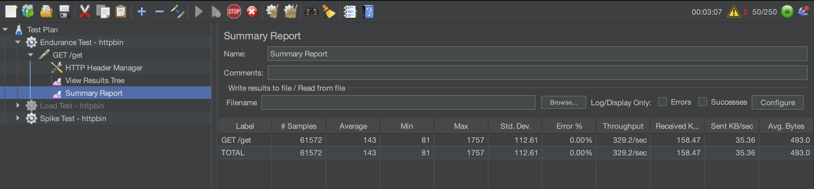
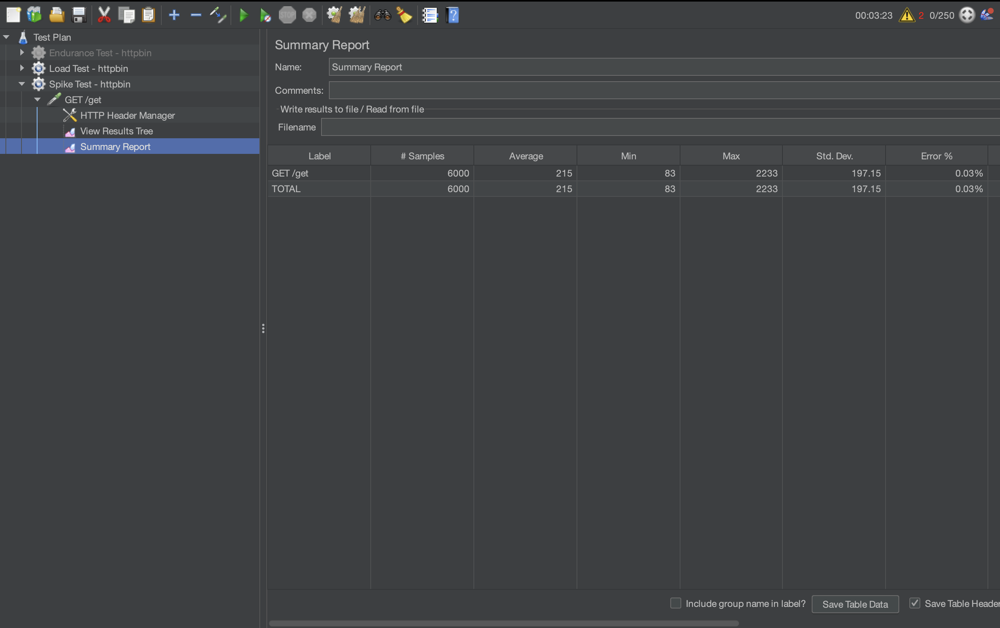

# Performance Testing with JMeter

## Introduction
This lab focuses on performance testing using Apache JMeter. The goal is to evaluate how a system behaves under different conditions, including sustained usage, increased load, and sudden spikes in traffic.

## Part 1: Performance Testing Concepts

### Load Testing
Load testing evaluates how a system performs under expected user traffic. It helps determine response times, throughput, and overall system stability under normal conditions.

### Endurance Testing
Endurance testing measures how a system performs over an extended period of time under a steady load. It helps identify issues such as memory leaks or performance degradation over time.

### Spike Testing
Spike testing evaluates how a system responds to sudden increases in user traffic. It helps determine whether the system can handle abrupt demand without failure.

### JMeter Components
JMeter uses several core components:
- Thread Groups: simulates users
- HTTP Request Sampler: sends requests to the server
- HTTP Header Manager: configures request headers
- Listeners (Summary Report, View Results Tree): display results

---

## Part 2: JMeter Testing

### Endurance Test
The endurance test was configured with:

  - 10 steady users, 
  - Ramp-up period of 10 seconds
  - Duration of 300 seconds. 

This setup simulates a steady and sustained workload over a period of time. The system maintained an average response time of approximately 165 ms with an error rate near 0%. This indicates that the system performs reliably under continuous load without noticeable degradation.

### Load Test
The load test was configured with: 
  - 50 concurrent users
  - Ramp-up period of 20 seconds
  - Loop count of 20. 

This test increases the number of active users to evaluate performance under higher demand. The results showed an average response time of approximately 206 ms and an error rate of 0.15%. 

Compared to the endurance test, response time increased and a small number of errors appeared, indicating that performance begins to degrade slightly as load increases. This behavior is expected as increased concurrency introduces resource contention on the system.

### Spike Test
The spike test was configured with: 

  - 200 concurrent users
  -Ramp-up period of 1 second
  -Loop count of 10. 

This configuration simulates a sudden surge in traffic. The results showed an average response time of approximately 218 ms, throughput of over 500 requests per second, and an error rate of 0.05%. Despite the rapid increase in traffic, the system remained stable with only minimal performance degradation, demonstrating resilience under sudden load spikes.

---

## Apdex
In these tests, most response times were under 500 ms, indicating that the majority of requests would be considered satisfactory. While response times increased under load and spike conditions, overall performance remained within an acceptable range, suggesting a generally positive user experience.

---

## Conclusion
Overall, the system performed well across all test scenarios. While response times increased under higher load and spike conditions, the system remained stable with minimal errors. This suggests that the application can handle increased and sudden traffic, though performance optimization may be needed at higher scales.