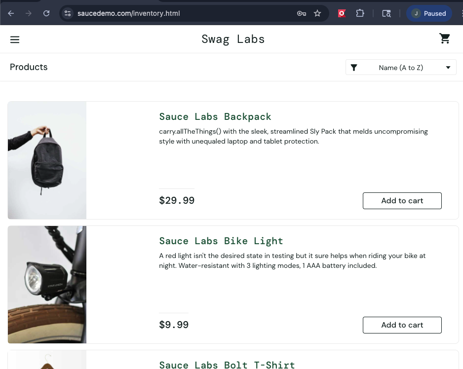

# Project 4: User Testing with Selenium

**Course:** Software Quality & Testing  
**Student:** Jonathan  
**Tool Used:** Katalon Recorder (Selenium-based)  
**Browser:** Google Chrome  
**Website Tested:** SauceDemo (https://www.saucedemo.com/)

---

# Table of Contents

1. Introduction  
2. Environment Setup  
3. Research: What is Selenium?  
4. Test Strategy  
5. Test Case 1: Login Validation  
6. Test Case 2: Add Item to Cart  
7. Test Case 3: Verify Cart Item and Price  
8. Test Results  
9. Issues Encountered  
10. Key Learnings  
11. Conclusion

---

# Introduction

This project focused on user interface testing using Selenium-based browser automation tools. The selected website was **SauceDemo**, a publicly available e-commerce testing application designed for practicing automated testing scenarios.

Rather than writing Selenium code in Java or Python, I used **Katalon Recorder**, a Chrome extension built on Selenium concepts that allows tests to be recorded and replayed through the browser.

The goal of this assignment was to automate realistic user scenarios such as logging in, adding products to a cart, and verifying item pricing. During testing, some automation instability occurred, so a hybrid approach was used: automation where reliable, and manual validation where needed.

---

# Environment Setup

| Component | Value |
|---|---|
| Operating System | macOS |
| Browser | Google Chrome |
| Testing Tool | Katalon Recorder |
| Application Under Test | SauceDemo |
| URL | https://www.saucedemo.com/ |

## Test Credentials

| Username | Password |
|---|---|
| `standard_user` | `secret_sauce` |

---

# Research: What is Selenium?

**Selenium** is an open-source framework used to automate web browsers. It is commonly used by QA engineers and software developers to validate that websites behave correctly.

## Core Selenium Components

| Component | Purpose |
|---|---|
| Selenium WebDriver | Automates browsers through code |
| Selenium IDE | Record and replay browser actions |
| Selenium Grid | Run tests across many browsers/machines |
| Browser Drivers | Connect Selenium to Chrome, Firefox, Edge |

## Why Selenium Matters

Selenium is valuable because it can:

- Repeat tests automatically  
- Reduce manual regression testing  
- Validate UI workflows  
- Support CI/CD pipelines  
- Test multiple browsers

---

# Test Strategy

The assignment instructions required Selenium-based user testing. SauceDemo was selected because it is designed for automation practice and contains stable login, cart, and pricing workflows.

Three tests were created:

| Test # | Scenario | Method |
|---|---|---|
| 1 | Login Test | Automated |
| 2 | Add Item to Cart | Manual Validation |
| 3 | Verify Cart Item and Price | Manual Validation |

---

# Test Case 1: Login Validation

## User Story

As a user, I want to log in successfully so that I can access the store inventory.

## Steps Performed

1. Navigate to `https://www.saucedemo.com/`
2. Click username field
3. Enter username: `standard_user`
4. Click password field
5. Enter password: `secret_sauce`
6. Click Login

## Expected Result

The user is redirected to the **Products** page after successful login.

## Actual Result

The Katalon test executed successfully. Login steps replayed correctly in some runs, although browser focus issues caused inconsistency during later attempts.

## Evidence

### Browser State During Test

### Additional Replay Evidence

---

# Test Case 2: Add Item to Cart

## User Story

As a shopper, I want to add an item to my shopping cart so that I can purchase it later.

## Steps Performed

1. Open SauceDemo
2. Log in with valid credentials
3. Locate **Sauce Labs Backpack**
4. Click **Add to cart**
5. Click cart icon

## Expected Result

The backpack appears in the shopping cart.

## Actual Result

The item was successfully added to the cart through manual validation.

---

# Test Case 3: Verify Cart Item and Price

## User Story

As a shopper, I want to verify the correct item and price in my cart so that pricing is accurate before checkout.

## Steps Performed

1. Log in
2. Add **Sauce Labs Backpack**
3. Open shopping cart
4. Verify item name
5. Verify price

## Expected Result

| Item | Price |
|---|---|
| Sauce Labs Backpack | $29.99 |

## Actual Result

The cart displayed the correct product name and price.

## Evidence

---

# Test Results

| Test Case | Description | Result |
|---|---|---|
| Test 1 | Login Validation | PASS (partial automation) |
| Test 2 | Add Item to Cart | PASS |
| Test 3 | Verify Cart Item and Price | PASS |

---

# Issues Encountered

During execution, several common UI automation issues occurred:

- Selenium IDE compatibility problems in Firefox  
- Katalon Recorder replay inconsistencies  
- Browser focus issues where text input did not always populate fields  
- Some tests passed execution steps without validating final outcomes  
- Dynamic timing caused element detection delays

These issues reflect real-world UI automation challenges.

---

# Key Learnings

This assignment reinforced several important testing principles:

1. Executing steps is not the same as validating behavior  
2. Assertions are required for trustworthy automation  
3. Browser timing and waits are critical in UI testing  
4. Public test sites are useful for learning automation  
5. Manual validation is still valuable when automation becomes unstable

---

# Conclusion

This project demonstrated both the strengths and limitations of browser automation tools. Selenium-based tools can quickly automate repetitive workflows such as login and cart interactions, but they also require stable selectors, proper timing, and reliable browser integration.

Through this assignment, I gained practical experience with browser automation, replay-based testing tools, troubleshooting failures, and validating e-commerce workflows. The most important takeaway was that successful testing is not only about running steps—it is about confirming the system behaves as expected.